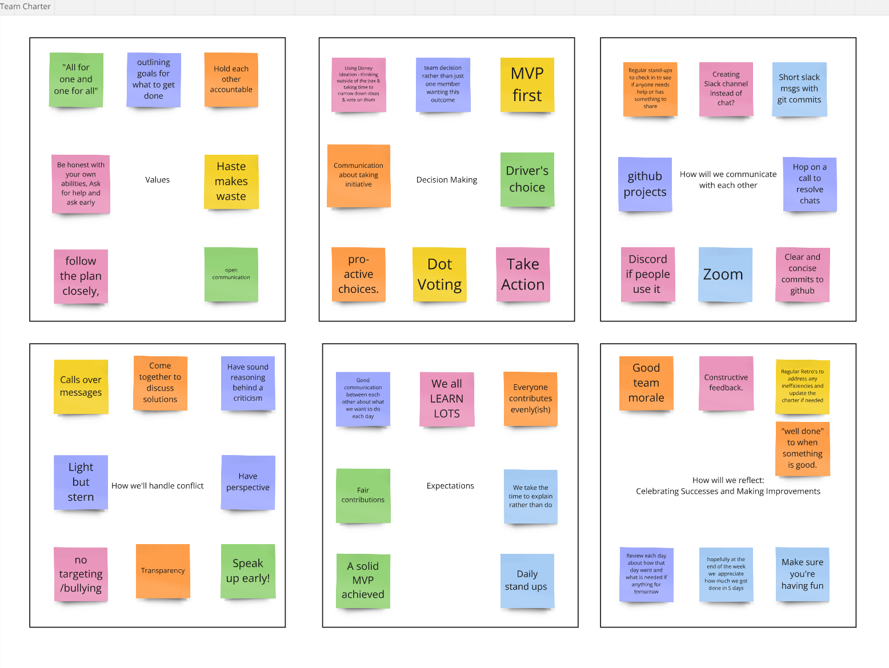

# Metis Study App

## The Project Title Statement

A simple app to match School of Code students and graduates based on shared subjects for study sessions or projects.

## Project Outline:

1. MVP Features
   - User Registration & Profile Creation.
   - A list of Study Buddy matches.
2. Tech Stack
   - Frontend: React, HTML/CSS/JavaScript.
   - Backend: Node.js, Supabase.
   - Deployment: Netlify.

## Future release features

- Ability to update profile without having to update it all.
- Smart matching on chosen subjects.
- In app messaging.

## Original Team pre-fork

<table>
   <tr style="width: 100%; display: flex; justify-content: space-between;"><td>Archie Reader</td><td>Elspeth Mardaljevic</td><td>Eric Roberts</td><td>Irena Binnebesel</td><td>Ryan Smith</td></tr>
   <tr style="width: 100%; display: flex; justify-content: space-between;"><td><a href="">LinkedIn</a></td><td><a href="">LinkedIn</a></td><td><a href="">LinkedIn</a></td><td><a href="">LinkedIn</a></td><td><a href="">LinkedIn</a></td></tr>
<table>

### Our Team Charter

## Press Release

### Metis Study App, your learning connection to your SoC study community

#### The School of Code bootcamp has a lot of content, lots to learn, and it is just the beginning of a never-ending learning journey. Sometimes it's easier and better journey and learn with others, providing instant feedback, new perspectives and support when you need it.This app will help you match with other SoC students/graduates in quick and efficient way in order to be able to study the subjects that matter to you, at a time that suits you and in a way that you'll get the most value

#### Testimonials

Archie says:

> OMG this really helped me study together with others, fitting it around my parental duties

Annamaria says:

> This helped me prep for interviews and I felt so much more confident going in to them knowing I'd had feedback from my peers

Faisal says:

> This is my favourite app EVER!!

Irena says:

> I connected with so many other people I wouldn't have otherwise and learnt loads.

Miro - https://miro.com/app/board/uXjVLbnZvJU=/?share_link_id=673975896156
